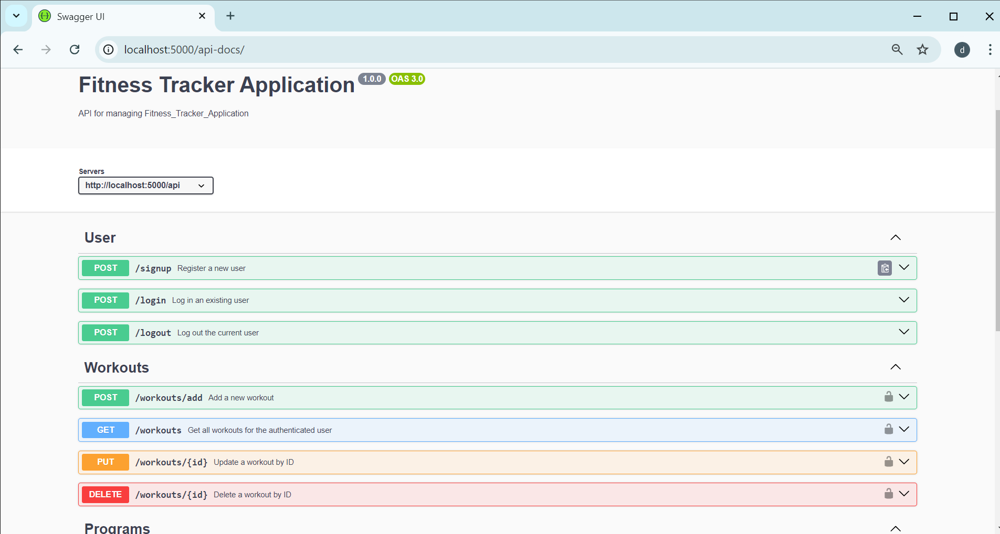
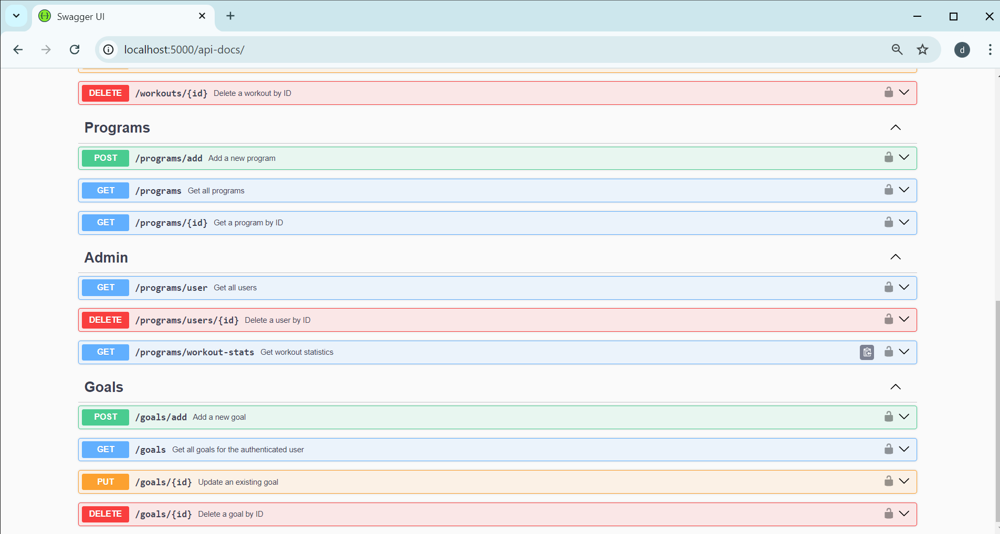

 <h1>Fitness Tracker Application</h1>
 

   ## Expense Swagger UI
   
   
   <br>
    


# Fitness Tracker Backend

This repository contains the backend for a fitness tracker application that allows users to log workouts, set fitness goals, and track their progress. The backend is built using Node.js, Express, and MongoDB, with JWT for user authentication.

## Table of Contents

- [Features](#features)
- [Technologies Used](#technologies-used)
- [Installation](#installation)
- [Environment Variables](#environment-variables)
- [Usage](#usage)
- [API Endpoints](#api-endpoints)
- [Deployment](#deployment)
- [Contributing](#contributing)
- [License](#license)

## Features

- **User Authentication**: JWT-based authentication with two roles:
  - Admin: Manage all users, create fitness programs, and view user statistics.
  - User: Log workouts, set goals, and view personal progress.
  
- **Workout Management**: CRUD API endpoints for:
  - Logging workouts.
  - Setting and tracking goals.
  
- **Statistics Generation**: Generate and visualize workout statistics by date range, activity type, and goal achievement status.

- **Admin-Specific Functions**: 
  - View aggregate statistics.
  - Manage users and fitness programs.

## Technologies Used

- Node.js
- Express.js
- MongoDB
- Mongoose
- JSON Web Token (JWT)
- Render (for deployment)

## Installation

1. Clone the repository:
   ```bash
   git clone https://github.com/Devanshiballar/-Fitness_Tracker_Application.git


### Setup .env file
MONGO_URL=Your_mongo_url
PORT=Sevice_port
NODE_ENV=NODE_ENVIRINMENT
JWT_SECRET=jwt_secret


### Run this app locally

shell
npm run build


### Start the app

shell
npm start
